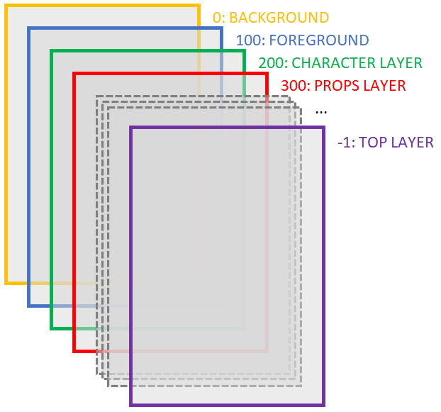

# NFT CREATOR

## Intro

NFT Creator can generate random combinations of images

## Directory structure for layers

```
|-- assets
   |-- images
      |-- 0. background1.jpg
      |-- 0. background-blue.jpg
      |-- 0. background-night.jpg
      |-- 0. background-violet.jpg
      |-- 100. foreground-forest.jpg
      |-- 100. desert.jpg
      |-- 100. trees.jpg
      |-- 101. stars-white.jpg
      |-- 101. stars-yellow.jpg
      |-- 101. stars-colorful.jpg
      |-- 102. clouds.jpg
      |-- 200. character1.jpg
      |-- 200. character2.jpg
      |-- 200. character3.jpg
      |-- 300. glasses1.jpg
      |-- 300. collar1.jpg
      |-- 301. mustache1.jpg
      |-- 301. cap1.jpg
```

Layers will be separated programmatically according to the prefix number of the file name. You must use a "." just after the number.

## Layers order


